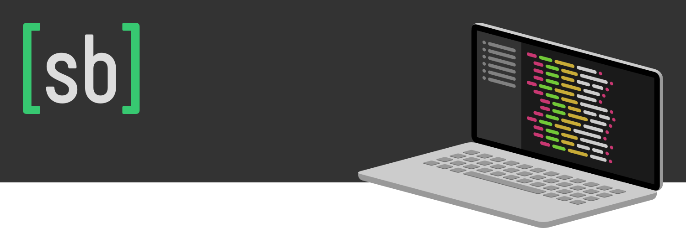

# Hi, I'm Stefano! 

👨🏻‍💻 I'm a self-taught web designer & developer from Italy.

💻 My job is mainly about creating tailor-made WordPress websites. This led me to build my own starter theme, Bricks, which I released publicly as my first Open-Source project.

🎨 Front-End is my favorite area of web development, and I also have a strong interest for design and SEO's technical aspects. Jamstack related technologies are my new passion, in particular Vue, Nuxt and their ecosystem.

🐧 I'm an enthusiast Linux user. It was 2008 when I tried my first Ubuntu Live USB, and after a few years spent with some of its derivatives, I finally ended my distro-hopping by landing on KDE-powered openSUSE, which I run in a custom Slimbook laptop.

📚 I also love swimming, sci-fi, history and science.

<h2 align="center">My Online Presence</h2>

<h2 align="center">My Techs & Tools</h2>

<h2 align="center">My GitHub Stats</h2>

<h2 align="center">My Projects</h2>

<h2 align="center">My Contributions</h2>

